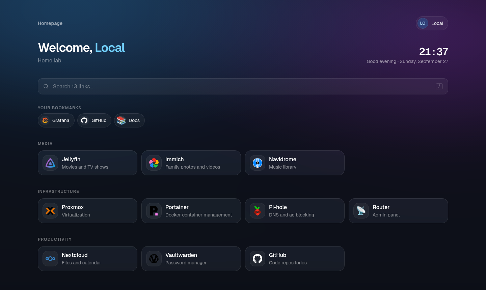
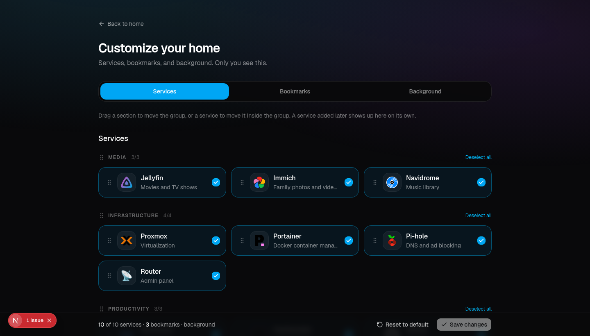

# Home Dash

Start page for the services on your network. Config is YAML in a data folder, and a refresh picks up edits.

A new install is single-user: one person, and no Authelia. A `settings.yaml` with no `singleUser` key is the same. Set `singleUser: false` to turn Authelia on.



## Features

- Service groups from `services.yaml`, with search (`/` focuses the box)
- A status dot on each service, and **Check status** to probe them now
- Clock and date
- Bookmarks for that user only. Create, edit, reorder, and remove them from **Customize home**. Up to 40. Stored in that user's `home.yaml`
- A background for that same user: an image URL, or an upload (png, jpeg, webp, gif, avif, up to 8 MB), plus blur and opacity. The file stays in that user's folder
- Customize is three tabs: **Services**, **Bookmarks**, and **Background**. `showBookmarks: false` hides bookmarks on the home page and drops the Bookmarks tab. The saved list stays in the file
- Icons from [dashboardicons.com](https://dashboardicons.com/), Simple Icons, a file in `icons/`, an image URL, or an emoji
- Authelia is off unless `singleUser: false`

## Quick start

```bash
docker compose up -d --build
```

Open `http://<server>:3000`.

The container reads `/app/data`. Mount whatever host folder you want there. The Compose file in this repo uses `./data`. The image ships examples, and an empty `config/` is filled from them on first start. That host folder must be writable by uid 1000 (`sudo chown -R 1000:1000 /path/to/data`).

```
/path/to/data/          # your folder, mounted at /app/data
├── config/
│   ├── settings.yaml
│   ├── services.yaml
│   └── users.yaml      # read only when singleUser is false
├── icons/              # icon: logo.png
├── cache/icons/        # only when cacheIcons is true
└── users/
    └── local/
        ├── home.yaml
        └── background.png   # after an upload
```

`users/local/` is the single-user home. The account menu shows **Local**. With Authelia on, each person gets `users/<username>/` instead.

Without Compose:

```bash
docker build -t homepage-dashboard .
docker run -d --name homepage -p 3000:3000 \
  -v /path/to/data:/app/data \
  --restart unless-stopped homepage-dashboard
```

`package.json` and the lockfile are their own image layer, so a code-only rebuild does not run `npm ci` again.

In single-user mode, keep the port on your own network. Anyone who can open the page can change that home.

Logs go to stdout: `docker logs homepage`, or `docker compose logs -f homepage`. See [Logs](#logs).

## Configuration

### services.yaml

Groups, then services. Leave out `users` and `groups` to show a service to everyone. Single-user mode shows every service. With Authelia on and no identity headers, only those public services show. A user with `role: admin` in `users.yaml` sees every service.

```yaml
- Media:
    - Jellyfin:
        href: http://192.168.1.10:8096
        description: Movies and TV shows
        icon: jellyfin

- Infrastructure:
    - Proxmox:
        href: https://proxmox.home.lan:8006
        icon: proxmox
        ping: https://192.168.1.2:8006
        users: [alex]
        groups: [admins]
```

| Field | What it does |
| --- | --- |
| `href` | Link. Omit it and the card stays on the page, with no destination |
| `description` | Line under the name |
| `icon` | See [Icons](#icons) |
| `ping` | URL to probe instead of `href`, or `false` to skip the check |
| `target` | `_blank` or `_self`. Overrides the setting in `settings.yaml` |
| `users` | Authelia usernames or display names allowed to see it |
| `groups` | Authelia groups allowed to see it |

The status check runs in the container, so use an address the container can reach. A response whose body is the Authelia portal counts as offline, including HTTP 200. Any other HTTP response under 500 counts as online. Self-signed certificates are accepted. Set `ping` to an internal URL when the public address is behind Authelia.

### settings.yaml

| Field | Default | |
| --- | --- | --- |
| `title` | `Homepage` | Page title |
| `subtitle` | hidden | Text under the title. `null` hides it |
| `columns` | `4` | Columns on a wide screen (1-6) |
| `target` | `_blank` | How links open |
| `statusCheck` | `true` | Status dots |
| `statusInterval` | `60` | Seconds between checks (minimum 5) |
| `showClock` | `true` | Clock and date |
| `showBookmarks` | `true` | That user's bookmarks on the home page and in Customize |
| `singleUser` | `true` | One local user. `false` turns Authelia on. A missing key stays single-user |
| `cacheIcons` | `false` | Save catalog icons under `cache/icons/` |
| `auth.enabled` | `true` | Read identity headers when Authelia is on. `false` shows a guest. It does not enable single-user mode |
| `auth.headers.*` | `Remote-User`, `Remote-Name`, `Remote-Email`, `Remote-Groups` | Header names from nginx |
| `auth.accountUrl` | | Manage account link in the user menu |
| `auth.logoutUrl` | | Sign out link |

A YAML error is shown on the page, with the file name, and written to the log.

### Bookmarks and background

Open the account menu and choose **Customize home**.

**Services** hides cards and reorders them. Drag a service inside its group, or drag the group title to move the group. A service added later in `services.yaml` shows up for everyone allowed to see it. A new group is added at the end. **Reset to default** deletes `home.yaml` and any uploaded background.

**Bookmarks** is that user's list. Name, link, optional icon. Drag to reorder, edit a row, or remove it, then save. Links are `http` or `https`. The list is `customBookmarks` in `home.yaml`, shown as chips above the services. `showBookmarks: false` hides the chips and this tab. Turning it back on restores the list.

**Background** takes an image URL or an upload. png, jpeg, webp, gif, and avif are accepted, up to 8 MB. Anything else is refused, and the page says why. Blur is 0-40. Opacity is 0-1. Empty means the dark page. An upload is saved next to `home.yaml` (`background.png`, or the matching extension) and is served only for that user. One user's image does not change another's.



### Single-user mode

This is the default.

```yaml
singleUser: true
```

Omit the key and the result is the same. Headers are ignored. The home file is `users/local/home.yaml`. That user sees every service. `users.yaml` is ignored.

`npm run dev` runs in this mode.

### Authelia

Opt in with:

```yaml
singleUser: false
```

An install that already has `singleUser: false` stays on Authelia. `users.yaml` is read only in this mode. There is no password form. nginx forwards Authelia's identity headers. The username is matched first (case-insensitive), then the display name. Set `username` when two people share a display name.

```yaml
users:
  - displayName: Alex Morgan
    username: alex
    email: alex@example.com
    avatar: https://example.com/alex.png
    role: Admin
```

`role: admin` sees every service. Any other role is a label in the menu.

In the `location` that proxies to the dashboard, after `auth_request`:

```nginx
auth_request_set $user   $upstream_http_remote_user;
auth_request_set $name   $upstream_http_remote_name;
auth_request_set $email  $upstream_http_remote_email;
auth_request_set $groups $upstream_http_remote_groups;
proxy_set_header Remote-User   $user;
proxy_set_header Remote-Name   $name;
proxy_set_header Remote-Email  $email;
proxy_set_header Remote-Groups $groups;
```

Header names are `auth.headers` in `settings.yaml`. A person who is missing from `users.yaml` still gets a menu, with a note to add them. No headers means the page shows Guest, and Customize is unavailable.

The folder name is the Authelia username. Set `username` so it stays stable. With no username, the folder is a slug of the display name.

Those headers are trustworthy when the container is reached through nginx. Anyone who can open the port directly can send their own `Remote-Name`.

`auth.enabled: false` stops reading headers and shows a guest, with no personal home and no Customize. It is separate from `singleUser`.

To try Authelia on the dev server, set `singleUser: false` in the data folder's `settings.yaml`, then:

```bash
DEV_REMOTE_NAME="Alex Morgan" DEV_REMOTE_USER=alex npm run dev
```

`DEV_REMOTE_*` is ignored in production, and ignored while single-user mode is on.

### Icons

The `icon` field on a service or a bookmark:

- A name from [dashboardicons.com](https://dashboardicons.com/), such as `jellyfin`
- `si-<name>` for [Simple Icons](https://simpleicons.org/), such as `si-github`
- A file in `icons/`, extension included (`icon: logo.png`). png, svg, webp, jpg, gif, ico, and avif work. A file that matches a catalog name (`icons/jellyfin.svg`) is used instead of the CDN
- An image URL (`https://...`). The browser loads it. It is not saved
- An emoji

`cacheIcons: true` downloads Dashboard Icons and Simple Icons into `cache/icons/` the first time they are shown, then serves that copy.

### Logs

Startup prints the data folder, the uid, and whether `config/`, `users/`, and `icons/` are writable. After the files load it prints the title and how many services it found. With Authelia on it also prints the user list. It prints whether the icon cache is on, and how identity works: single-user, the header names, or guest because `auth.enabled` is false.

Opening a page logs the identity: no headers, a matched user, or a name that is not in `users.yaml`. The same line is skipped for five minutes. Saves, resets, background uploads, and YAML errors are logged. Ordinary page views are not.

## Development

Node.js 22.

```bash
npm install
npm run dev
```

The dev server is `http://localhost:43127`. The data folder is `./data` (gitignored), copied from `./config` on first start. Override it with `DATA_DIR`.

Next.js, TypeScript, Tailwind CSS.
